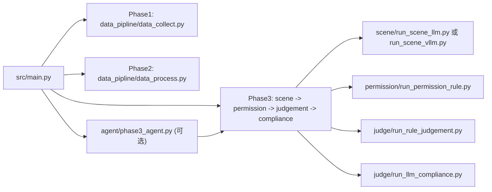

# llmui

Android 权限场景分析流水线（科研/实验工具），分为三阶段：
1. `Phase1`：APK 自动化采集（`adb + fastbot`）
2. `Phase2`：原始链路处理（OCR、控件解析、权限链修复）
3. `Phase3`：场景识别、权限识别、规则裁决、LLM 合规复核

---

## 1. 环境要求

- Python `3.9+`
- Android `adb` 可用
- fastbot 运行环境（设备侧）
- tesseract OCR（`Phase2` 需要）
- OpenAI-compatible 接口（本地 vLLM 或其他）

安装依赖：

```bash
pip install -r requirements.txt
```

---

## 2. 配置方式（推荐）

统一配置文件：`src/configs/settings.py`  
推荐使用 `.env.example` 中的 `LLMMUI_*` 变量。

核心变量：

- `LLMMUI_DATA_ROOT` / `LLMMUI_RAW_DIR` / `LLMMUI_PROCESSED_DIR`
- `LLMMUI_PROMPT_DIR`
- `LLMMUI_SCENE_RULE_FILE`
- `LLMMUI_FASTBOT_TIME_LIMIT` / `LLMMUI_FASTBOT_THROTTLE`
- `LLMMUI_ANDROID_DATA_DIR`
- `LLMMUI_VLLM_TEXT_URL` / `LLMMUI_VLLM_TEXT_MODEL`
- `LLMMUI_VLLM_VL_URL` / `LLMMUI_VLLM_VL_MODEL`
- `LLMMUI_AGENT_BASE_URL` / `LLMMUI_AGENT_MODEL`
- `LLMMUI_LLM_RESPONSE_TIMEOUT`

示例：

```bash
export LLMMUI_PROCESSED_DIR=/Users/charon/Downloads/code/llmmui/data/processed
export LLMMUI_VLLM_TEXT_URL=http://127.0.0.1:8001/v1/chat/completions
export LLMMUI_VLLM_VL_URL=http://127.0.0.1:8002/v1/chat/completions
```

---

## 3. 一键入口与命令

统一入口：`src/main.py`

### 3.1 全流程（Phase1 + Phase2 + Phase3）

```bash
python3 src/main.py full /path/to/apk_or_dir --scene-mode text
```

### 3.2 仅采集（Phase1）

```bash
python3 src/main.py phase1 /path/to/apk_or_dir
```

### 3.3 仅处理（Phase2）

```bash
python3 src/main.py phase2 /path/to/raw_root --processed-root /path/to/processed_root
```

### 3.4 仅分析（Phase3）

```bash
python3 src/main.py phase3 /path/to/processed_root --scene-mode text
```

关闭合规复核：

```bash
python3 src/main.py phase3 /path/to/processed_root --no-compliance
```

### 3.5 Agent 编排 Phase3

```bash
python3 src/main.py agent /path/to/processed_root --agent-instruction "执行完整三阶段分析"
```

---

## 4. 文件关系与代码职责

### 4.1 主流程关系



### 4.2 关键模块说明

- `src/main.py`：统一 CLI 入口，串接各阶段
- `src/configs/settings.py`：唯一配置源（环境变量兼容）
- `src/configs/runtime_config.py`：对外兼容层，读取 `settings.py`
- `src/data_pipline/data_collect.py`：设备交互、安装/卸载 APK、拉取 fastbot 结果
- `src/data_pipline/data_process.py`：从 raw 数据生成结构化 `result.json` 与 `chain_*.png`
- `src/analy_pipline/scene/run_scene_llm.py`：文本场景识别
- `src/analy_pipline/scene/run_scene_vllm.py`：图文场景识别（VL）
- `src/analy_pipline/permission/run_permission_rule.py`：规则权限识别
- `src/analy_pipline/judge/run_rule_judgement.py`：场景-权限规则裁决
- `src/analy_pipline/judge/run_llm_compliance.py`：高风险链路的 LLM 合规复核
- `src/analy_pipline/agent/phase3_agent.py`：LangGraph 编排 + 后处理
- `src/utils/http_retry.py`：HTTP 重试工具（LLM 请求）
- `src/utils/validators.py`：结果文件结构校验
- `src/utils/utils.py`：命令执行与日志工具

### 4.3 配置/规则/Prompt 关系

- `src/configs/domain/scene_config.py`：16 类场景定义和场景 prompt 加载
- `src/configs/domain/permission_config.py`：权限词典和映射规则
- `src/configs/domain/scene_permission_rules_16.json`：规则裁决知识库
- `src/configs/prompt/*.txt`：scene/compliance/arbiter 所需 prompt 模板

---

## 5. 输入输出约定

### 5.1 Phase2 输入输出

- 输入：`data/raw/fastbot-*/tupleOfPermissions.json` + 截图/XML
- 输出：`data/processed/fastbot-*/result.json`、`tupleOfPermissions.json`、`chain_*.png`

### 5.2 Phase3 输出（每个 APK 目录）

- `results_scene_llm.json` 或 `results_scene_vllm.json`
- `result_permission_rule.json`
- `result_rule_judgement.json`
- `result_llm_compliance_v3.json`（若开启合规复核）
- `result_final_decision.json`（agent 模式后处理产物）

---

## 6. scripts 目录说明

- `scripts/run.sh`：快速启动 agent 示例
- `scripts/evaluate/*.py`：当前评估脚本（场景/权限评估与统计）
- `scripts/test/*.py`：连通性测试脚本
- `scripts/utils/*.py`：辅助处理脚本
- `scripts/experiments/*`：历史实验脚本与图表素材

---

## 7. 常见问题

1. LLM 请求失败：检查 `LLMMUI_VLLM_TEXT_URL` / `LLMMUI_VLLM_VL_URL`
2. 找不到数据目录：检查 `LLMMUI_RAW_DIR` / `LLMMUI_PROCESSED_DIR`
3. Phase2 无输出：确认 raw 目录含 `fastbot-*` 与 `tupleOfPermissions.json`
4. OCR 识别弱：确认本机 tesseract 已安装且语言包可用

---

## 8. 最小可运行检查（建议）

先跑一个已存在的 processed 目录：

```bash
python3 src/main.py phase3 data/processed --scene-mode text --no-compliance
```

如果成功，会在每个 `fastbot-*` 目录看到 `results_scene_llm.json`、`result_permission_rule.json`、`result_rule_judgement.json`。
